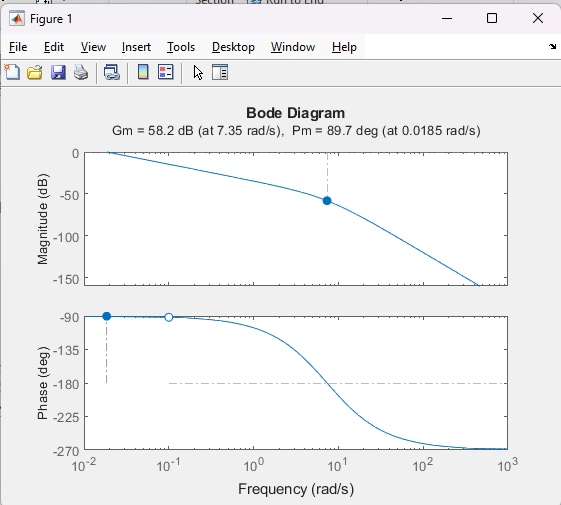
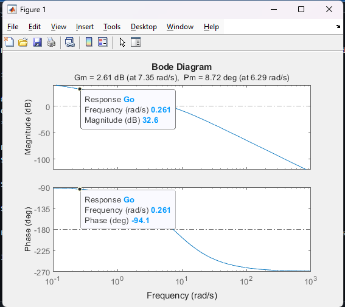
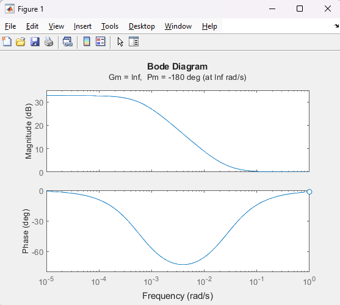

# Diseño de redes de atraso por análisis de frecuencia
## Introduccion
El diseño de redes de atraso por analis de frecuencia se basa en ajustar la respuesta de un sistema mediante la modificación de su comportamiento en el dominio de la frecuencia. Este se utiliza para reducir la ganancia del sistema en frecuencias altas, lo que ayuda a mejorar la estabilidad y a reducir la sensibilidad al ruido, sin afectar las frecuencias bajas.

En el contexto del análisis de frecuencia, el diseño se apoya en el uso de diagramas de Bode, que son representaciones gráficas de la respuesta en frecuencia de un sistema. A través de estos diagramas, es posible medir y ajustar los márgenes de estabilidad del sistema, como el margen de ganancia y el margen de fase, que indican cuánta ganancia o fase se puede agregar al sistema antes de que se vuelva inestable.
## Ventajas del diseño por diagrama de bode
Estos gráficos permiten visualizar el error en estado estacionario y el análisis de frecuencia. Además, facilitan la medición directa de los márgenes de estabilidad de una manera muy similar a los diseños en el dominio del tiempo cuando las funciones se realizan a una frecuencia angular (w).
## Controladores por análisis en frecuencia
El compensador de adelanto de fase es el que incrementa la velocidad de respuesta del sistema y los márgenes de estabilidad, el compensador de atraso de fase es el que reduce la ganancia en frecuencias altas sin afectar las bajas, reduciendo el ancho de banda y mejorando la resistencia al ruido y el compensador atraso-adelanto, combina las ventajas de ambos compensadores, mejorando márgenes de estabilidad, ancho de banda y reduciendo el error en estado estacionario.
## Control PID
Este tipo de controlador es un caso especial de compensación atraso-adelanto. La parte PD afecta las altas frecuencias y mejora el ángulo de adelanto de fase, lo que incrementa la estabilidad del sistema. Por otro lado, la parte PI actúa como una red de atraso. Aunque es posible sintonizar un PID mediante análisis en frecuencia, la sintonización generalmente se realiza en el dominio del tiempo debido a su facilidad de análisis.
## Margen de ganancia
El margen de ganancia (MG) es el cambio en la ganancia de lazo abierto requerido para que un sistema en lazo cerrado sea inestable. Se mide en decibelios (dB) y se toma como referencia la fase de 180°. Si MG es positivo, el sistema es estable; si es negativo, el sistema puede volverse inestable.
## Margen de fase
El margen de fase (MP) es el cambio en la fase de lazo abierto necesario para que un sistema en lazo cerrado se vuelva inestable. Este se mide en grados y se toma como referencia cuando la ganancia es unitaria (0 dB). Un MP mayor a -180° indica estabilidad, mientras que un MP menor a -180° puede indicar inestabilidad.
## Imagen de ejemplo

Figura 1. Figura de ejemplo.

Un sistema con MG y MP positivos es estable, pero si alguno de estos márgenes es cero o negativo, el sistema puede volverse inestable. Además, se recomienda que estos márgenes sean lo más grandes posible para garantizar estabilidad.
## Respuesta temporal en sistemas continuos y su relación entre margen de fase y maximo sobreimpulso
Para sistemas de segundo orden, el margen de fase está directamente relacionado con el porcentaje del maximo sobreimpluso (%overshoot). Generalmente, este sobrepaso se aproxima con base en el margen de fase disponible. El margen de fase y el porcentaje de sobrepaso están relacionados, de modo que un mayor margen de fase reduce el overshoot en la respuesta del sistema. 
## Procedimiento de diseño
Para diseñar un controlador utilizando análisis en frecuencia se deben seguir lo siguientes pasos: Primero, se discretiza la planta analógica para obtener su equivalente digital G(z), luego se transforma a G(w) y se grafican los diagramas de Bode. A partir de estos gráficos, se diseña la compensación necesaria y se recupera la función C(z) para implementarla en el controlador digital.
## 💡**Ejemplo**
Se presenta un ejemplo práctico de cómo corregir el error de estado estacionario utilizando un compensador.

### Procedimiento de diseño
Se inicia el proceso discretizando la planta analógica para obtener su equivalente digital 𝐺(𝑧). Luego, se transforma esta función a la frecuencia angular G(w), graficando los diagramas de Bode correspondientes. Posteriormente, se diseña la compensación adecuada en C(w), y se recupera la función compensadora en C(z), para implementarla en el controlador digital.
### Corrección del error en estado estacionario
El ejemplo plantea la corrección del error de estado estacionario. La relación entre el error de velocidad ($e_{v}$)
 y la ganancia proporcional (𝐾𝑝) se analiza para garantizar que el sistema cumpla con un error aceptable ($e_{v} ≤ 0.1$). En este caso, 
𝐾𝑝 debe ser mayor o igual a 20 para corregir el error de manera efectiva.
### Diagrama de Bode en lazo abierto
Se presenta el diagrama de Bode para el sistema en lazo abierto, donde se observa que los márgenes de fase y ganancia no cumplen inicialmente los requisitos de estabilidad. Esto marca la necesidad de un ajuste en el controlador.
### Diagrama de Bode en lazo cerrado
Al cerrar el lazo, el sistema no cumple con el margen de fase requerido. Este análisis impulsa el diseño de una red de atraso que pueda mejorar la estabilidad del sistema en lazo cerrado.
### Respuesta temporal
La respuesta temporal del sistema revela que la falta de cumplimiento en los márgenes de fase y ganancia afecta negativamente el desempeño dinámico, mostrando una velocidad de respuesta lenta y posibles inestabilidades.
### Redes de atraso
En esta etapa se introduce la red de atraso, representada por la fórmula: $C_{w}=\frac{1+𝑎T_{1}w}{1+T_{1}w}$.
​Donde el parámetro (𝑎) determina la atenuación en altas frecuencias y $T_{1}$ ajusta el comportamiento del sistema.
### Metodología de diseño para la red de atraso
Se describen los pasos para calcular la red de atraso. El primer paso es calcular 𝐾𝑝 para garantizar el requerimiento de error, luego medir los márgenes, para calcular la frecuencia para cumplir con un margen de fase mayor al requerido ($𝑀𝑝 + 6°$), y medir la atenuación necesaria a la frecuencia de cruce.
### Medición de márgenes con 𝐾𝑝
Tras ajustar 𝐾𝑝, se mide nuevamente el margen de fase en lazo abierto. En este punto, los márgenes aún no son suficientes, lo que indica que se debe continuar ajustando los parámetros del sistema.
### Encontrar la frecuencia que cumpla con el margen de fase
Se procede a calcular la frecuencia que garantiza el margen de fase deseado. La relación entre el margen de fase requerido ($𝜙_{𝑚}$) y la fase actual (𝜙) es fundamental para determinar la frecuencia a la que se debe aplicar la red de atraso.
### Cuánto se debe deformar el diagrama
El objetivo es ajustar el diagrama de Bode de manera que cruce el eje de 0 dB en la frecuencia correcta, garantizando que el margen de fase requerido sea cumplido. Este paso implica deformar el diagrama de manera controlada.
### Midiendo la atenuación requerida
Si la atenuación requerida es de 20 dB, el valor de $𝑎$ en la red de atraso se calcula como: $A=10^{−\frac{𝑎}{20}}$
En este caso, A resulta ser 0.1, lo cual corresponde a una atenuación adecuada para cumplir los márgenes.
### Cálculo de 𝑇1
Finalmente, se calcula 𝑇1 utilizando la relación: $T_{1}=\frac{10}{A*w_{G}}$. Donde 𝜔𝐺 es la frecuencia de cruce de ganancia. Este valor se ajusta para asegurar que la red de atraso funcione correctamente, permitiendo cumplir con los márgenes de fase y ganancia necesarios para la estabilidad del sistema.

## Ejercicios
### Parte 1
* Se tiene la siguiente funcion: $G(w)= \frac{1}{w(w+9)(w+6)}$
* Hallar Kp para un error de estado estacionaro $e_{v}$ menor al 3%
  

Figura 2. Imagen Lazo abierto.

Haciendo los calculos $Kp < 500$, en este caso se toma un valor mayor a 500 para seguir con el ejercicio sera de 600 el valor de Kp

Figura 3. Imagen Lazo cerrado.

### Parte 2
Continuando con el ejercicio anterior
* Hallar un controlador que cumpla con MG de 40 db y Mp de 80°.

Primero se procede a calcular la frecuencia que garantiza el margen de fase deseado.
$𝜙=180° - 𝜙_{𝑚}$

$𝜙=180° - 86°$

$𝜙=94°$

Esta frecuencia se ubica en el diagrama y se toma el valor del margen de ganacia en ese punto.

Figura 4. Imagen identificacion de puntos.

Para este caso $𝑎 = 32.6 db$

$A=10^{−\frac{𝑎}{20}}$

$A=0.023$ y $w_{G}=0.261 Hz$

Con estos valores se calcula T1

$T_{1}=\frac{10}{A*w_{G}}$

$T_{1}=\frac{10}{0.023*0.261}$

$T_{1}=1665.83$

El controlador seria $C(w)=\frac{1+38.31w}{1+1665.83}$

Y el nuevo diagrama seria 

Figura 5. Imagen Diagrama bode con controlador.
